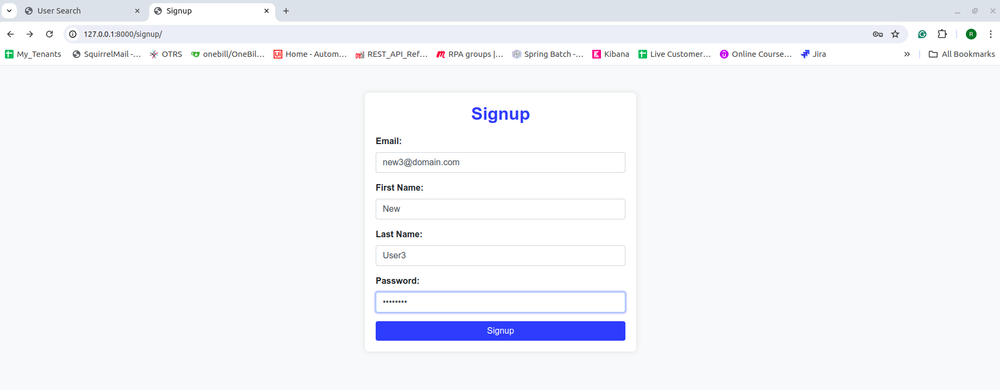
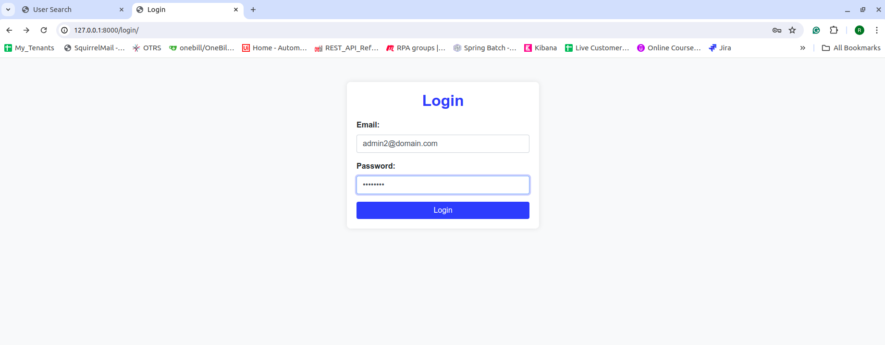
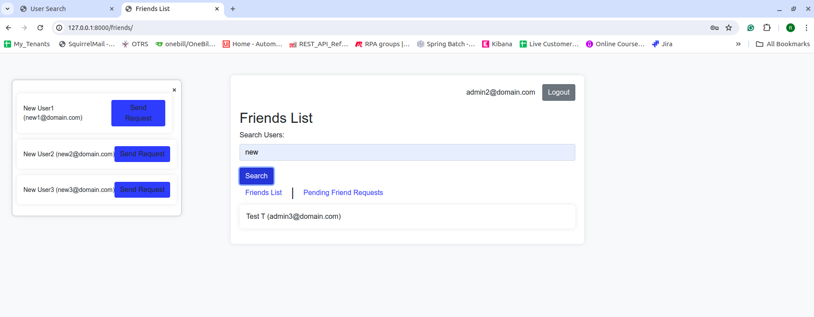
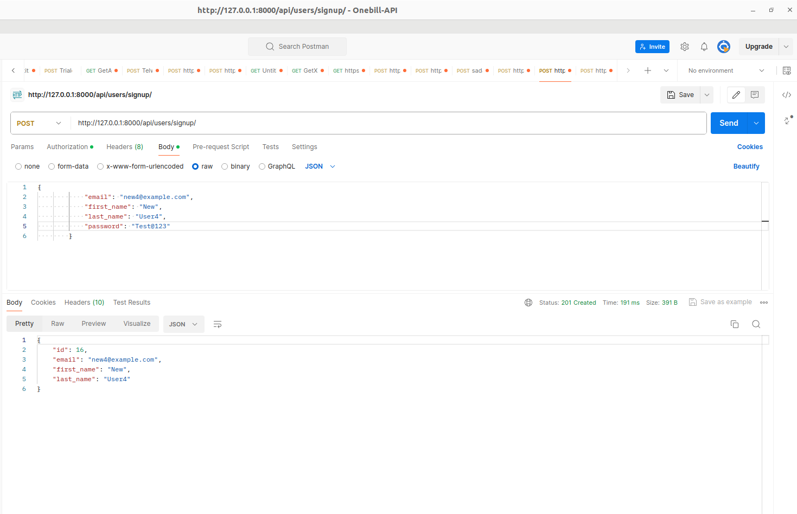
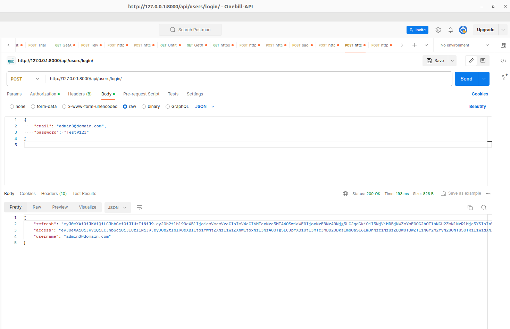
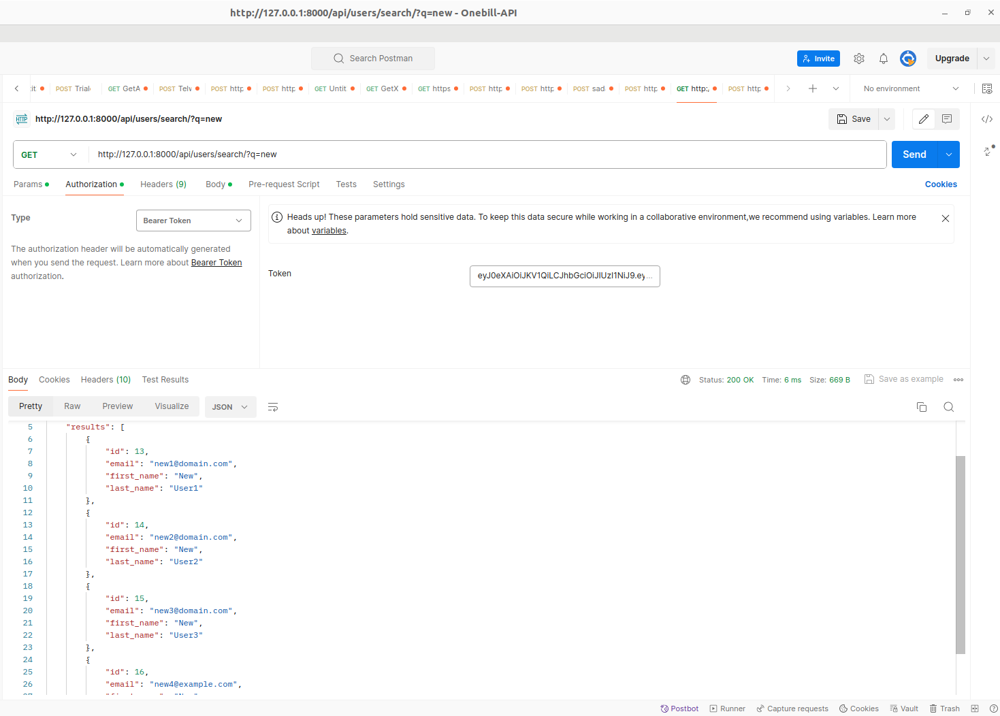
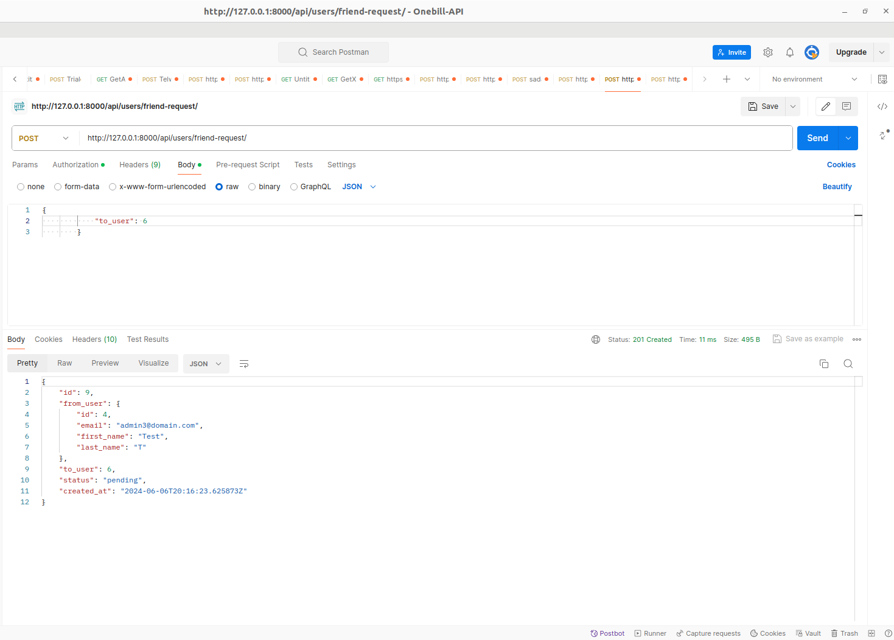
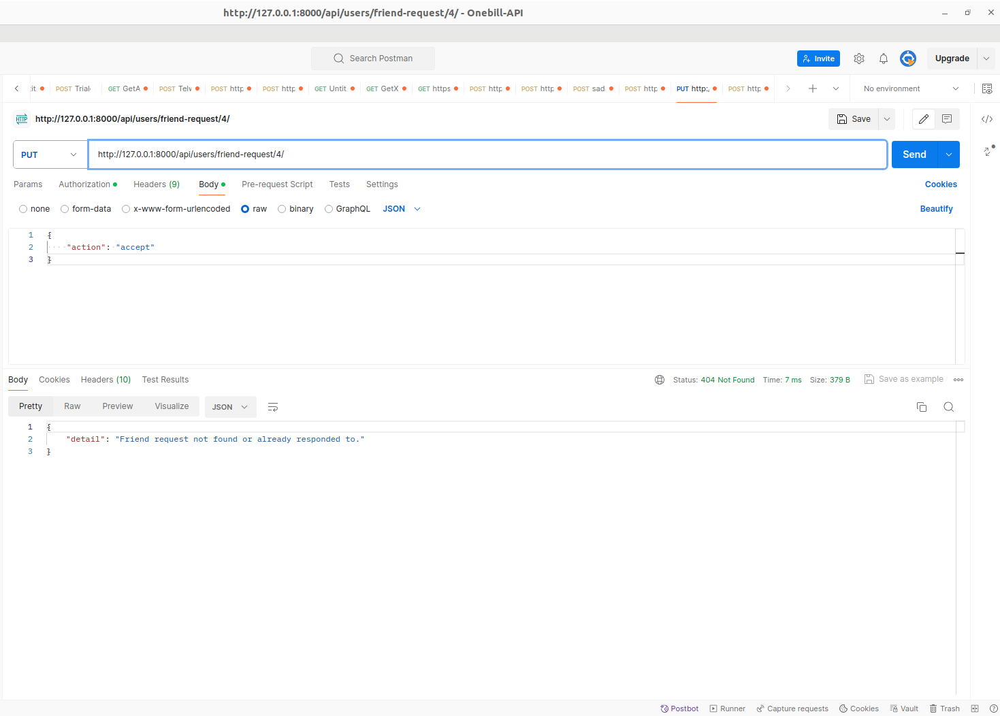
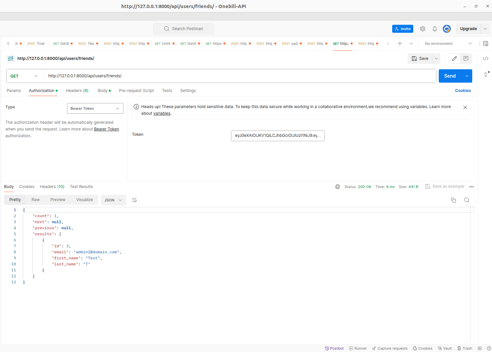
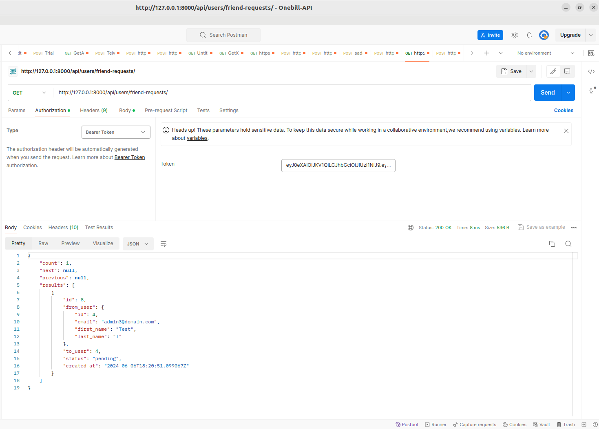

# Social Networking Application

## Table of contents

[Project Description](https://github.com/Rakesh3537/Social_Networking/blob/main/README.md#project-description)

[Features](https://github.com/Rakesh3537/Social_Networking/blob/main/README.md#features)

[Tech Stack](https://github.com/Rakesh3537/Social_Networking/blob/main/README.md#tech-stack)

[Installation](https://github.com/Rakesh3537/Social_Networking/blob/main/README.md#installation)

[API Endpoints](https://github.com/Rakesh3537/Social_Networking/blob/master/README.md#api-endpoints)

[Screenshots](https://github.com/Rakesh3537/Social_Networking/blob/main/README.md#screenshots)

[Contact](https://github.com/Rakesh3537/Social_Networking/blob/main/README.md#contact)

## Project Description

This Django application provides essential social networking functionalities, including user authentication, friend requests, and friend lists.

## Features

- **Signup:** Users can sign up for the application via both the UI and API.
- **Login:** Once signed up, users can log in to the application securely.
- **Search User:** Users can efficiently search for other users using a search keyword, accessible through both the API and UI.
- **Friend Request** Users can send, accept, or reject friend requests to connect with others on the platform.
- **Friends List** Users can conveniently view their list of friends, facilitating easy navigation and interaction with connections.
- **Pending Request** Users can access a list of pending friend requests, enabling them to manage incoming requests efficiently.
- **Complexity** The application is designed with simplicity in mind, ensuring a straightforward user experience.
- **Security** API endpoints are secured with token-based authentication, safeguarding user data and interactions.


## Tech Stack

**Stack:** Python, Django, Django Rest Framework, dbsqlite3, JSON, JWT Authentication, DRF Pagination

**Server:** localhost:8000


## Installation

1. Clone the repository:

    ```bash
    git clone https://github.com/Rakesh3537/Social_Networking.git
    ```

2. Navigate to the project directory:

    ```bash
    cd Social_Networking
    ```

3. Install dependencies:

    ```bash
    python -m venv venv

    source venv/Scripts/activate

    pip install django

    pip install djangorestframework

    pip install -r requirements.txt
    ```

4. Apply migrations:

    ```bash
    python manage.py makemigrations

    python manage.py migrate
    ```

5. Create SuperUser:

     ```bash
    python manage.py createsuperuser 
    ```

6. Run the development server:

    ```bash
    python manage.py runserver
    ```

7. Server:

    ```bash
    http://localhost:8000/  or http://127.0.0.1:8000/
    ```


## API Endpoints

1. **Signup**: Register a new user.

    - **URL**: `/api/users/signup/`
    - **Method**: `POST`
    - **Request Body**:

        ```json
        {
            "email": "new7@example.com",
            "first_name": "New",
            "last_name": "User7",
            "password": "Test@123"
        }
        ```

    - **Response**:

        ```json
        {
            "id": 1,
            "email": "new7@example.com",
            "first_name": "New",
            "last_name": "User7"
        }
        ```

2. **Login**: Authenticate a user and receive access and refresh tokens.

    - **URL**: `/api/users/login/`
    - **Method**: `POST`
    - **Request Body**:

        ```json
        {
            "email": "new7@example.com",
            "password": "Test@123"
        }
        ```

    - **Response**:

        ```json
        {
            "refresh": "<refresh_token>",
            "access": "<access_token>",
            "username": "new7@example.com"
        }
        ```

3. **Search Users**: Search for users by email, first name, or last name.

    - **URL**: `/api/users/search/?q=<search_query>`
    - **Method**: `GET`
    - **Response**: List of users matching the search query.

4. **Send Friend Request**: Send a friend request to another user.

    - **URL**: `/api/users/friend-request/`
    - **Method**: `POST`
    - **Request Body**:

        ```json
        {
            "to_user": <user_id>
        }
        ```

    - **Response**: Success message or error if the request fails.
    
        ```json
        {
			"id": 9,
			"from_user": {
			"id": 4,
			"email": "admin3@domain.com",
			"first_name": "Test",
			"last_name": "T"
			},
			"to_user": 6,
			"status": "pending",
			"created_at": "2024-06-06T20:16:23.625873Z"
		}
        ```

5. **Accept/Reject Friend Request**: Accept or reject a pending friend request.

    - **URL**: `/api/users/friend-request/<friend_request_id>/`
    - **Method**: `PUT`
    - **Request Body**:

        ```json
        {
            "action": "accept"  # or "reject"
        }
        ```

    - **Response**: Success message or error if the request fails.

6. **Friends List**: Get a list of friends for the authenticated user.

    - **URL**: `/api/users/friends/`
    - **Method**: `GET`
    - **Response**: List of friends for the user.

7. **Pending Friend Requests**: Get a list of pending friend requests for the authenticated user.

    - **URL**: `/api/users/friend-requests/`
    - **Method**: `GET`
    - **Response**: List of pending friend requests for the user.


## Screenshots

__HTML Pages Screenshots__

__Signup Page__



__Login Page__



__Friends List Page__




__API Screenshots__

__Signup API Endpoint__



__Login API Endpoint__



__Search API Endpoint__



__Friend Request API Endpoint__



__Accept Reject API Endpoint__



__Friend List API Endpoint__



__Pending Request API Endpoint__




## Contact

If you have any questions or suggestions, feel free to contact me,

Email - rakeshyadhav575@gmail.com

LinkedIn - [Rakesh T](https://www.linkedin.com/in/rakesh-t-1489341b7)
